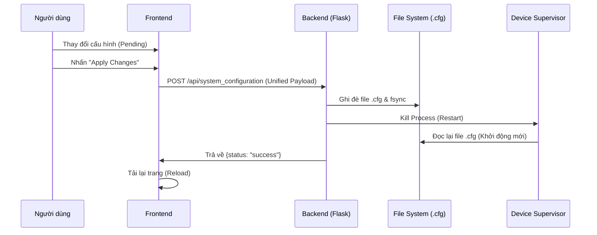

# Device Supervisor Bridge

Hệ thống trung tâm dùng để kết nối, giám sát thời gian thực và cấu hình các thiết bị năng lượng mặt trời (Inverters, Meters, Loggers) thông qua giao thức Modbus và API. Hệ thống hỗ trợ tính toán dữ liệu ảo (Virtual Controllers), đồng bộ lên Cloud (ThingsBoard/MQTT) và ghi nhật ký dữ liệu chuyên sâu vào SQLite.

## 🏗 Kiến trúc Hệ thống

Hệ thống được xây dựng theo mô hình **Backend-Frontend tách biệt**:
*   **Backend (Python/Flask/Eventlet):** Xử lý giao tiếp MQTT, quản lý cấu hình thiết bị, tính toán dữ liệu, và giao tiếp với SQLite.
*   **Frontend (JS/Chart.js/Socket.IO):** Giao diện quản trị thời gian thực với khả năng tùy chỉnh cấu hình thiết bị và biểu đồ linh hoạt.

```text
DI_EVN_SCADA/

├── src/                    # Mã nguồn backend
|   |── main.py                 # Điểm khởi chạy chính
│   ├── api_utils.py        # Giao tiếp API Gateway
│   ├── app_instance.py     # Khởi tạo Flask & SocketIO
│   ├── app_state.py        # Quản lý bộ nhớ tạm (Cache)
│   ├── cloud_service.py    # Đồng bộ lên Cloud
│   ├── config_utils.py     # Xử lý cấu hình thiết bị
│   ├── db_utils.py         # Quản lý SQLite & Downsampling
│   ├── inhand_services.py  # Bridge dữ liệu với InHand
│   ├── mqtt_utils.py       # Xử lý MQTT telemetry
│   └── routes/             # Các API Endpoint
│       ├── api_routes.py
│       ├── solar_config_routes.py
│       └── system_config_routes.py
├── templates/              # File mẫu (Template) thiết bị
│   ├── Inverter/
│   ├── Logger/
│   ├── Meter/
│   └── Other/
├── web_frontend/           # Mã nguồn Frontend
│   ├── index.html          # Trang chủ
│   ├── js/                 # Logic JS
│   │   ├── main.js         # Lõi điều khiển
│   │   ├── apiService.js   # Dịch vụ gọi API
│   │   ├── page-calculation.js
│   │   ├── page-cloud-config.js
│   │   ├── page-controls.js
│   │   ├── page-details.js
│   │   ├── page-overview.js
│   │   ├── page-services.js
│   │   ├── page-solar-config.js
│   │   └── page-system-config.js
│   └── style.css
├── calculations.json       # Cấu hình phép tính
├── cloud_upload_rules.json # Quy tắc đẩy Cloud
├── logging_rules.json      # Whitelist ghi nhật ký DB
├── protocols.json          # Định nghĩa giao thức
├── requirements.txt        # Danh sách thư viện
└── README.md
```

## 📁 Cấu trúc Thư mục

### Backend (Python)
- `main.py`: Điểm khởi chạy chính, quản lý các tiến trình nền.
- `app_state.py`: Quản lý Cache toàn cục và Threading Locks.
- `mqtt_utils.py`: Xử lý việc sub/pub dữ liệu MQTT.
- `db_utils.py`: Quản lý CSDL SQLite và cơ chế downsampling (1ph, 5ph).
- `cloud_service.py`: Đồng bộ dữ liệu lên Cloud (MQTT Telemetry).
- `inhand_services.py`: Cầu nối dữ liệu với hệ thống thiết bị InHand.
- `config_utils.py`: Xử lý việc đọc/ghi và tái tạo cấu hình hệ thống.
- `api_utils.py`: Tương tác với API Gateway (đăng nhập, giám sát IEC104).

### Frontend (JavaScript/Static)
- `js/main.js`: Lõi điều khiển, quản lý kết nối Socket.IO.
- `js/apiService.js`: Dịch vụ tập trung xử lý các yêu cầu API (fetch).
- `js/page-overview.js`: Logic trang tổng quan và biểu đồ công suất.
- `js/page-solar-config.js`: Logic cấu hình thiết bị (thêm/sửa/xóa).
- `js/page-calculation.js`: Quản lý Virtual Controllers và các phép tính (Calculations).

### Cấu hình & Dữ liệu
Hệ thống sử dụng các tệp JSON để lưu trữ cấu hình:
- `calculations.json`: Công thức tính toán (SUM, AVG, Max, Min...).
- `cloud_upload_rules.json`: Quy tắc đồng bộ dữ liệu Cloud.
- `logging_rules.json`: Danh sách Whitelist các biến đo cần ghi vào DB.
- `virtual_controllers.json`: Danh sách các Virtual Controllers.
- `chart_config.json`: Cấu hình đường vẽ biểu đồ Overview.

## 🚀 Tính năng Nổi bật

1.  **Tính toán thời gian thực:** Tạo các biến ảo (Calculated Tags) dựa trên công thức linh hoạt.
2.  **Downsampling thông minh:** Tự động tối ưu hóa lưu trữ DB với các bảng dữ liệu 1 phút và 5 phút.
3.  **Logging Whitelist:** Kiểm soát dữ liệu đầu vào DB, tránh quá tải ổ đĩa Flash.
4.  **Real-time Config:** Nhiều cấu hình áp dụng ngay lập tức thông qua Socket.IO mà không cần khởi động lại.
5.  **CT/PT Handling:** Tự động tính toán lại gain cho các thiết bị Meter dựa trên thông số biến dòng/áp.

## 🛠 Cách triển khai

1.  **Cài đặt môi trường:**
    ```bash
    pip install -r requirements.txt
    ```
2.  **Cấu hình:** Chỉnh sửa các đường dẫn trong `constants.py` để phù hợp với môi trường cài đặt (đường dẫn `/var/user/...`).
3.  **Khởi chạy:**
    ```bash
    python main.py
    ```
4.  **Truy cập:** Mở trình duyệt tại `http://<IP_GATEWAY>:8000`.

## ⚙️ Yêu cầu hệ thống
- Hệ điều hành: Linux (khuyến nghị cho các thiết bị Gateway/Embedded).
- Python 3.8+
- SQLite3 (đã cài đặt sẵn)
- Broker MQTT (ví dụ: EMQX) hoạt động tại localhost:9009.
## 🔄 Luồng dữ liệu (Data Flow)

Dữ liệu đi qua hệ thống theo hành trình từ **Thiết bị thật (Southbound)** đến **Người dùng cuối (Northbound)** như sau:

### 1. Thu thập dữ liệu
*   **Thiết bị thực tế:** Các biến (measures) từ Inverter, Meter được đọc thông qua Modbus.
*   **Bridge Layer:** `inhand_services.py` thực hiện polling và đẩy dữ liệu thô vào **Broker MQTT** (topic `internal/modbus/telemetry`).

### 2. Xử lý & Lưu trữ
*   **MQTT Consumer:** `mqtt_utils.py` lắng nghe dữ liệu, lọc theo `LOGGING_WHITELIST`, sau đó:
    *   **Lưu trữ:** Đẩy vào hàng đợi (`DB_WRITE_QUEUE`) để ghi vào **SQLite DB**.
    *   **Cache:** Cập nhật vào `realtime_data_cache` – trung tâm dữ liệu của hệ thống.
*   **Calculation Loop:** Quét các công thức trong `calculations.json`, tính toán (SUM, AVG, Max, Min) và cập nhật kết quả vào cache.

### 3. Hiển thị & Đồng bộ
*   **Socket.IO:** Khi dữ liệu cache thay đổi, server phát sự kiện `page_data_update` qua Websocket. Trình duyệt nhận sự kiện này để cập nhật trực tiếp lên Dashboard và Biểu đồ.
*   **Cloud Service:** Tự động đồng bộ các biến theo cấu hình `CLOUD_UPLOAD_RULES` lên các nền tảng IoT Cloud qua giao thức MQTT.

## 🔌 Tài liệu API (API Documentation)

Hệ thống cung cấp RESTful API để Frontend tương tác với Backend. Tất cả phản hồi (response) đều ở định dạng JSON.

### 1. Solar Configuration
*   `GET /api/solar_configuration`
    *   **Mô tả:** Lấy danh sách thiết bị, trạng thái template và cấu hình hiện tại.
*   `POST /api/solar_configuration`
    *   **Mô tả:** Cập nhật cấu hình Solar (thêm/sửa/xóa thiết bị, cấu hình thông số CT/PT).

### 2. Manual & Virtual Controls
*   `POST /api/update_manual_value`
    *   **Mô tả:** Cập nhật giá trị hằng số (ví dụ: đặt công suất cố định cho Virtual Controller).
*   `POST /api/update_manual_state`
    *   **Mô tả:** Cập nhật trạng thái công tắc (0/1).
*   `POST /api/write_device_value`
    *   **Mô tả:** Gửi lệnh ghi trực tiếp xuống thiết bị vật lý qua MQTT (cho các biến `readWrite: "rw"`).

### 3. Historical Data
*   `GET /api/history`
    *   **Mô tả:** Lấy dữ liệu lịch sử phục vụ biểu đồ.
    *   **Parameters:** 
        *   `sensor_ids`: Chuỗi ID thiết bị (cách nhau bằng dấu phẩy).
        *   `start_time`: Unix timestamp (bắt đầu).
        *   `end_time`: Unix timestamp (kết thúc).
        *   `resolution`: Tùy chọn `auto` | `raw` | `1min` | `5min`.

### 4. System & Cloud
*   `GET/POST /api/system_configuration`
    *   **Mô tả:** Đọc/Ghi cấu hình cổng COM, Cloud MQTT, và tham số IEC104.
*   `GET/POST /api/cloud_upload_rules`
    *   **Mô tả:** Quản lý các biến được phép đẩy lên Cloud.
*   `GET/POST /api/logging_rules`
    *   **Mô tả:** Quản lý Whitelist các biến được phép ghi vào Database.

---

## 🔄 Luồng dữ liệu: Cấu hình Hệ thống (Config Lifecycle)

Khi người dùng thực hiện thay đổi cấu hình (thêm thiết bị, sửa thông số), dữ liệu tuân theo quy trình hợp nhất để đảm bảo tính nhất quán:

### Quy trình "Sửa - Lưu - Tái khởi động"

1.  **Giai đoạn Pending (Frontend):** Thay đổi được lưu tạm trên trình duyệt (`appData.pending_changes`). Người dùng có thể chỉnh sửa nhiều hạng mục trước khi áp dụng.
2.  **Giai đoạn Unified Payload (Submit):** Khi nhấn "Apply Changes", Frontend gom toàn bộ thay đổi từ: `Devices (Solar)` + `System (COMs)` + `Cloud (MQTT)` + `IEC104` thành một `unifiedPayload` duy nhất.
3.  **Giai đoạn Backend Processing:**
    *   Backend nhận `unifiedPayload` qua `POST /api/system_configuration`.
    *   Hợp nhất dữ liệu mới với cấu hình gốc từ `device_supervisor.cfg`.
    *   Ghi đè file `.cfg` mới và dùng lệnh `os.fsync()` để ép dữ liệu xuống ổ đĩa Flash.
    *   Kill tiến trình `device_supervisor` đang chạy để hệ thống tự động khởi động lại với cấu hình mới.

### Sơ đồ Luồng Cấu hình (Config Flow)



```mermaid
graph LR
    subgraph Southbound [Thiết bị ngoại vi]
        Device[Thiết bị thật] -->|Modbus| Bridge[InHand Bridge]
    end

    subgraph Backend [Backend Service]
        Bridge -->|MQTT| MQTT[MQTT Broker]
        MQTT -->|Subscription| Processor[mqtt_utils.py]
        Processor -->|Update| Cache[(realtime_data_cache)]
        Processor -->|Queue| DB[SQLite DB]
        Cache <-->|Tính toán| Calc[Calculation Loop]
    end

    subgraph Northbound [Người dùng]
        Cache -->|Socket.IO| Socket[Socket.IO Server]
        Socket -->|Realtime Update| Browser[Trình duyệt Web]
    end

    style Device fill:#f9f,stroke:#333
    style Browser fill:#bbf,stroke:#333
    style Cache fill:#ff9,stroke:#333Lite fill:#bbf,stroke:#333,stroke-width:2px
    style MQTT fill:#ff9,stroke:#333

